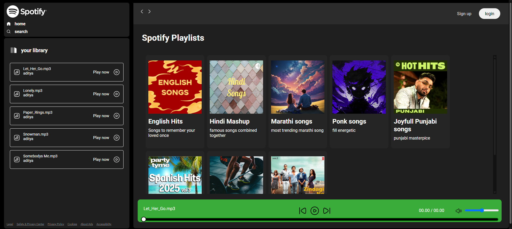
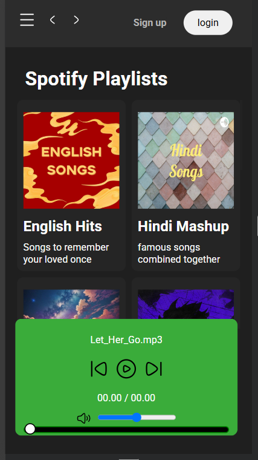
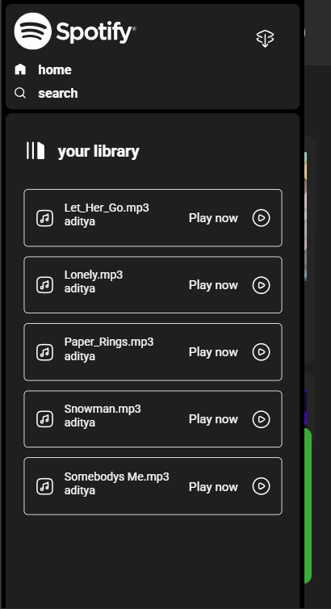

# Introduction
A responsive web-based clone of the Spotify music player built using HTML, CSS, and JavaScript. This project replicates the core UI and some basic functionality of Spotify, including a song library, play controls, and a playlist section.
 ## Features
🎧 Modern UI inspired by the official Spotify web player

📱 Responsive design for different screen sizes

📂 Song library structure

▶️ Play, pause, next, and previous controls

🔊 Volume control slider

📊 Custom progress bar with draggable seek feature

💡 Hamburger menu for mobile navigation
Tech Stack
HTML5 – used for Structure of the application

CSS3 – Styling and responsive layout using Flexbox

JavaScript (Vanilla) – UI interactivity and player control logic
## screenshots
### PC view (home page)

### mobile view (home page)


## 🔧 Setup Instructions

Follow these steps to run the project locally:

1. **Clone the repository:**

   ```bash
   git clone https://github.com/Adityanaik4545/Spotify-clone.git
   ```
   ```bash
   cd Spotify-clone
   ```
  ## Open the project in your browser:

Double-click on index.html

Or open the project in VS Code and click "Open with Live Server" (you need the Live Server extension installed)
